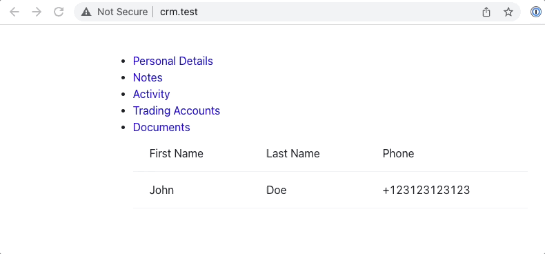

# Financial CRM Page

This is a work-in-progress of financial CRM page:

## Overview

Even though the work is incomplete, it features the following:

- Laravel 8 with fully configured tooling for SASS and ReactJS with HMR (hot reloading)
- [React Router](https://reactrouter.com/) with configured routes similar to SPA
- Modular design using functional ReactJS components
- Data loading for components is done via [axios](https://github.com/axios/axios) to allow easy swap for remote API
- [Chakra-UI](https://chakra-ui.com/)

## Requirements

- PHP 8.1 with composer 2
- PHP-CGI
- Node v14 with npm

## Installation

- composer install
- npm install
- npm run dev
